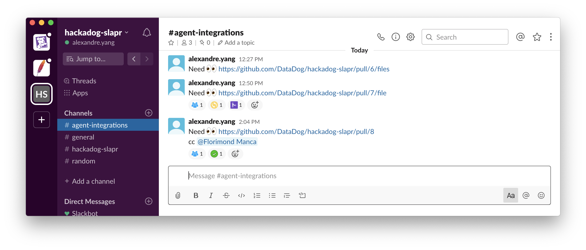

# Slapr

Add Pull Requests status emojis to Slack posts.



On `pull_request_review` or `pull_request` events Slapr will update your slack posts with suitable emojis.

## Slack posts

Slack posts should contain the PR URL.

Examples:

- Blabla Need Review for :eyes: https://github.com/DataDog/integrations-core/pull/5746/s
- Blabla Need Review for rev https://github.com/DataDog/integrations-core/pull/5746/s

## Requirements

Slack API Token with following permissions

- `channels:history`
- `reactions:read`
- `reactions:write`

## Emoji status

| emoji                        | description                                                  |
|------------------------------|--------------------------------------------------------------|
| `SLAPR_EMOJI_REVIEW_STARTED` | The PR has at least 1 in-progress review.                    |
| `SLAPR_EMOJI_APPROVED`             | The PR has all required approvals and is ready to be merged. |
| `SLAPR_EMOJI_NEEDS_CHANGES`        | Changes are requested for the PR.                            |
| `SLAPR_EMOJI_MERGED`               | The PR is merged.                                            |
| `SLAPR_EMOJI_CLOSED`               | The PR is closed.                                            |

## Example Usage

```yaml
name: Slack emoji PR updates
on:
  pull_request_review:
    types: [submitted]
  pull_request:
    types: [closed]

jobs:
  run_slapr:
    runs-on: ubuntu-latest
    steps:
    - uses: DataDog/slapr@master
      env:
        GITHUB_TOKEN: "${{ secrets.GITHUB_TOKEN }}"
        GITHUB_REPO: DataDog/slapr
        SLACK_CHANNEL_ID: CNY5XCHAA
        SLACK_API_TOKEN: "${{ secrets.SLACK_BOT_USER_OAUTH_ACCESS_TOKEN }}"
        SLAPR_BOT_USER_ID: UTMS06TPX
        SLAPR_NUMBER_OF_APPROVALS_REQUIRED: 2 # integer minimum=1 default=1. The number of approvals that are required for the approval emoji to be added in Slack
```

## Troubleshoot

If you get the following error during Slapr run:
```
slack.errors.SlackApiError: The request to the Slack API failed.
The server responded with: {'ok': False, 'error': 'account_inactive'}
```

Your `SLACK_BOT_USER_OAUTH_ACCESS_TOKEN` OAuth Token might not be valid anymore. If that's the case you should replace it with the one in `https://api.slack.com/apps/{your_app_id}/oauth`.
