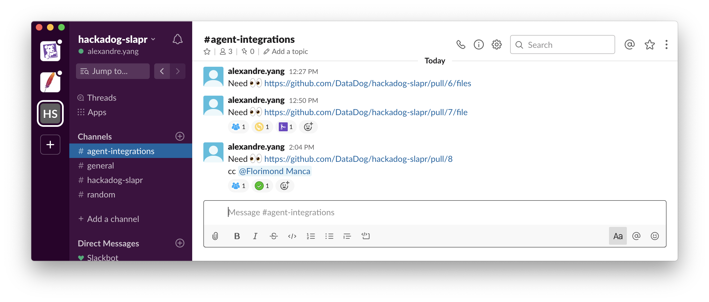

# Slapr

Add Pull Requests status emojis to Slack posts.



On `pull_request_review` or `pull_request` events Slapr will update your slack posts with suitable emojis.

## Slack posts

Slack posts should contain the PR URL.

Examples:

- Blabla Need Review for :eyes: https://github.com/DataDog/integrations-core/pull/5746/s
- Blabla Need Review for rev https://github.com/DataDog/integrations-core/pull/5746/s

## Requirements

Slack API Token with following permissions

- `channels:history`
- `channels:read` (required when using review-map)
- `reactions:read`
- `reactions:write`

## Emoji status

| emoji                        | description                                                  |
|------------------------------|--------------------------------------------------------------|
| `SLAPR_EMOJI_REVIEW_STARTED` | The PR has at least 1 in-progress review.                    |
| `SLAPR_EMOJI_APPROVED`       | The PR has all required approvals and is ready to be merged. |
| `SLAPR_EMOJI_NEEDS_CHANGES`  | Changes are requested for the PR.                            |
| `SLAPR_EMOJI_COMMENTED`      | A review has been submitted with comment only.               |
| `SLAPR_EMOJI_MERGED`         | The PR is merged.                                            |
| `SLAPR_EMOJI_CLOSED`         | The PR is closed.                                            |

## Review Map (multi-channel routing)

By default, slapr posts emoji reactions to a single Slack channel (`SLACK_CHANNEL_ID`). With the `review-map` input, you can route reactions to different Slack channels based on which GitHub teams are requested for review.

Create a YAML file mapping GitHub teams to Slack channels:

```yaml
# review-map.yaml
'@datadog/agent-apm':
  name: 'apm-agent'
  id: 'C01234ABCDE'          # preferred: name + id (no API call needed)
'@datadog/agent-build':
  name: 'agent-build'         # id omitted: resolved via Slack API at startup
'@datadog/agent-ci': 'DEFAULT_SLACK_CHANNEL'  # falls back to SLACK_CHANNEL_ID
```

- **Preferred format**: provide both `name` (for readability) and `id` (avoids Slack API rate limits).
- When `id` is omitted, the channel name is resolved via the Slack API at startup (requires `channels:read` scope).
- Use `DEFAULT_SLACK_CHANNEL` to route a team to the default `SLACK_CHANNEL_ID`.

On review events, slapr checks the reviewer's team membership (requires `read:org` scope on the GitHub token) and posts to the matching channel. On merge/close events, it uses the GitHub Timeline API to find all teams that were ever requested and posts to each of their channels.

When `review-map` is not set, behavior is identical to before (single channel).

**Note:** Team membership checks require the `read:org` scope. The default `GITHUB_TOKEN` does not have this — you need a PAT or GitHub App token.

## Example Usage

```yaml
name: Slack emoji PR updates
on:
  pull_request_review:
    types: [submitted]
  pull_request:
    types: [closed]

jobs:
  run_slapr:
    runs-on: ubuntu-latest
    steps:
    - uses: DataDog/slapr@master
      with:
        review-map: .github/review-map.yaml  # optional
      env:
        GITHUB_TOKEN: "${{ secrets.GITHUB_TOKEN }}"
        GITHUB_REPO: DataDog/slapr
        SLACK_CHANNEL_ID: CNY5XCHAA
        SLACK_API_TOKEN: "${{ secrets.SLACK_BOT_USER_OAUTH_ACCESS_TOKEN }}"
        SLAPR_BOT_USER_ID: UTMS06TPX
        SLAPR_NUMBER_OF_APPROVALS_REQUIRED: 2 # integer minimum=1 default=1. The number of approvals that are required for the approval emoji to be added in Slack
```

## Troubleshoot

If you get the following error during Slapr run:
```
slack.errors.SlackApiError: The request to the Slack API failed.
The server responded with: {'ok': False, 'error': 'account_inactive'}
```

Your `SLACK_BOT_USER_OAUTH_ACCESS_TOKEN` OAuth Token might not be valid anymore. If that's the case you should replace it with the one in `https://api.slack.com/apps/{your_app_id}/oauth`.
